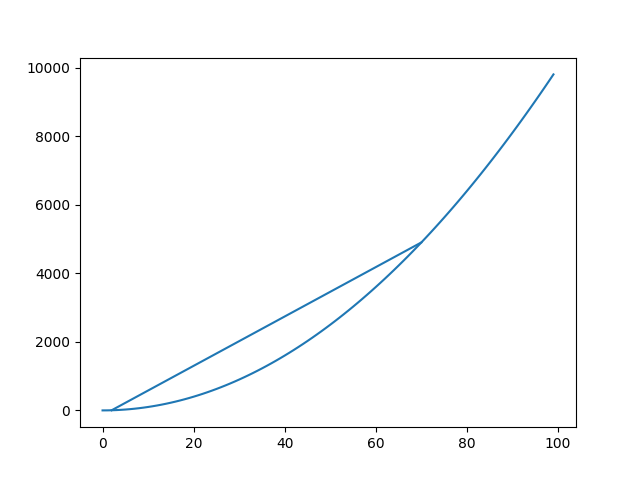
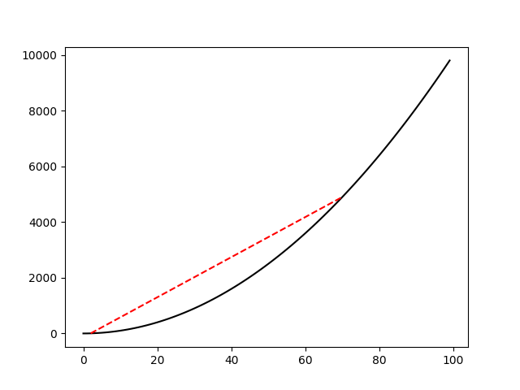
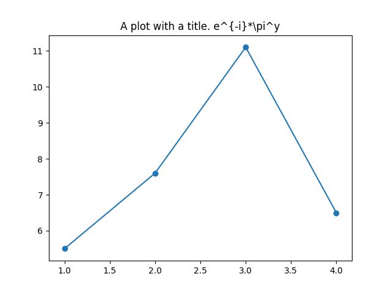
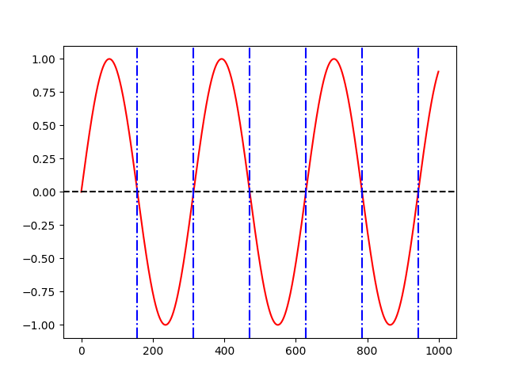
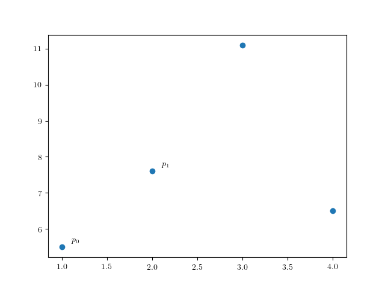
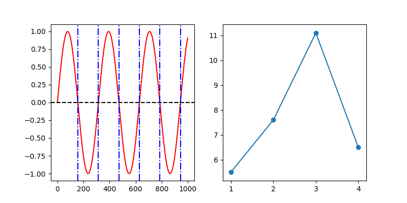
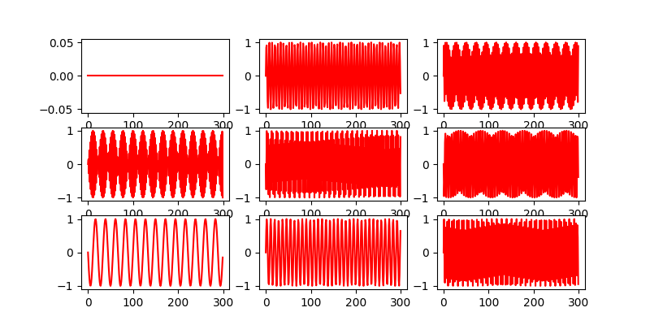

# examples

## plot types

### line, scatter with defaults

```crystal
figure = Matplotcr::Figure.new
lineplot = Matplotcr::LinePlot.new([1, 2, 3], [5.5, 7.6, 11.1])
lineplot2 = Matplotcr::ScatterPlot.new([1.0, 2.0, 4.5], [1, 2, 3])
figure.add lineplot
figure.add lineplot2
```


### line, scatter with options

```crystal
figure = Matplotcr::Figure.new
x = [1, 2, 3, 4]
y = [5.5, 7.6, 11.1, 6.5]
lineplot = Matplotcr::LinePlot.new(x, y, colour="red", linestyle="--")
lineplot2 = Matplotcr::ScatterPlot.new(x, y, colour="green")
figure.add lineplot
figure.add lineplot2
figure.save("docs/images/test_colour.png")
```


### histograms

With default values:

```crystal
y = Statistics::Normal.sample(1000, 0.0, 2.0)
figure = Matplotcr::Figure.new
hist = Matplotcr::Histogram.new(y)
figure.add hist
figure.save("docs/images/hist_default.png")
```


With custom number of bins:

```crystal
y = Statistics::Normal.sample(1000, 0.0, 2.0)
figure = Matplotcr::Figure.new
hist = Matplotcr::Histogram.new(y, bins=200)
figure.add hist
figure.save("docs/images/hist_bins.png")
```


### line segments

With default values:

```crystal
x = (0...100).to_a
y = x.map { |p| p**2 }
figure = Matplotcr::Figure.new
hist = Matplotcr::LinePlot.new(x, y)
figure.add hist
figure.add Matplotcr::Line.new({2.0, 4.0}, {70.0, 70.0**2})
```



Customised:

```crystal
x = (0...100).to_a
y = x.map { |p| p**2 }
figure = Matplotcr::Figure.new
hist = Matplotcr::LinePlot.new(x, y, colour="black")
figure.add hist
figure.add Matplotcr::Line.new({2.0, 4.0}, {70.0, 70.0**2}, colour="red", linestyle="--")
```



### titles and fonts

A plot with a title and custom font ("courier new" in this case):

```crystal
font = Matplotcr::RCFont.new "monospace", ["Courier New"]
figure = Matplotcr::Figure.new font: font
x = (0...1000).to_a
y = x.map { |n| Math.sin(n / 50.0) }
lineplot = Matplotcr::LinePlot.new(x, y, colour: "red")
title = Matplotcr::Title.new %q("A plot with a title (in Courier New).")
figure.add lineplot
figure.add title
```



### vertical and horizontal lines

```crystal
figure = Matplotcr::Figure.new
x = (0...1000).to_a
y = x.map { |n| Math.sin(n / 50.0) }
lineplot = Matplotcr::LinePlot.new(x, y, colour: "red")
figure.add lineplot
figure.add Matplotcr::HorizontalLine.new y: 0 , colour: "black", linestyle: "--"
(1..6).each { |i| figure.add Matplotcr::VerticalLine.new x: Math::PI * i * 50.0, colour: "blue", linestyle: "-."}
```



### annotations

```crystal
figure = Matplotcr::Figure.new
x = [1, 2, 3, 4]
y = [5.5, 7.6, 11.1, 6.5]
lineplot = Matplotcr::ScatterPlot.new(x, y)
figure.add lineplot
points = x.zip(y).map { |a,b| [a, b]}
(0...2).each { |i| figure.add Matplotcr::Annotation.new points[i][0] + 0.1, points[i][1] + 0.1, "p#{i}" }
```



## output options

### custom plot size

```crystal
figure = Matplotcr::Figure.new(figsize: {20.0, 2.0})
x = (0...1000).to_a
y = x.map { |n| Math.sin(n / 50.0) }
lineplot = Matplotcr::LinePlot.new(x, y, colour: "red")
figure.add lineplot
figure.add Matplotcr::HorizontalLine.new y: 0 , colour: "black", linestyle: "--"
(1..6).each { |i| figure.add Matplotcr::VerticalLine.new x: Math::PI * i * 50.0, colour: "blue", linestyle: "-."}
figure.save("docs/images/custom_size.png", dpi: 180)
```


### side-by-side plots

```crystal
figure = Matplotcr::Figure.new figsize: {8.0, 4.0}, grid: {1, 2}
x = (0...1000).to_a
y = x.map { |n| Math.sin(n / 50.0) }
lineplot = Matplotcr::LinePlot.new(x, y, colour: "red")
figure.add lineplot
figure.add Matplotcr::HorizontalLine.new y: 0 , colour: "black", linestyle: "--"
(1..6).each { |i| figure.add Matplotcr::VerticalLine.new x: Math::PI * i * 50.0, colour: "blue", linestyle: "-."}
figure.subplot()
x = [1, 2, 3, 4]
y = [5.5, 7.6, 11.1, 6.5]
lineplot = Matplotcr::LinePlot.new(x, y)
lineplot2 = Matplotcr::ScatterPlot.new(x, y)
figure.add lineplot
figure.add lineplot2
figure.save("docs/images/side_by_side.png")
```



### simple grid

```crystal
x = (0...300).to_a
figure = Matplotcr::Figure.new figsize: {8.0, 4.0}, grid: {3, 3}
(0...9).each { |n|
    if n > 0
        figure.subplot
    end
    figure.add Matplotcr::LinePlot.new(x, x.map { |i| Math.sin n.to_f * i}, colour: "red")
}
figure.save("docs/images/grid.png")
```

