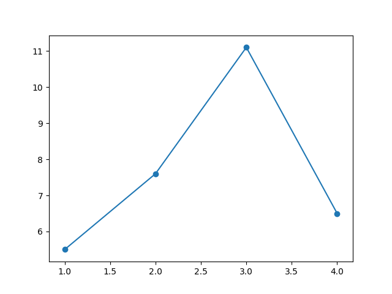
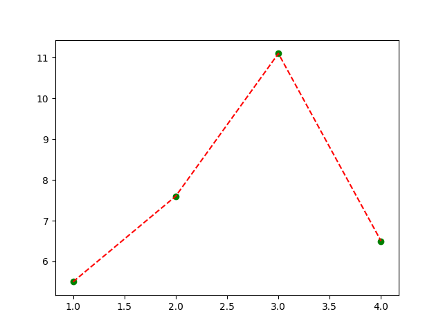
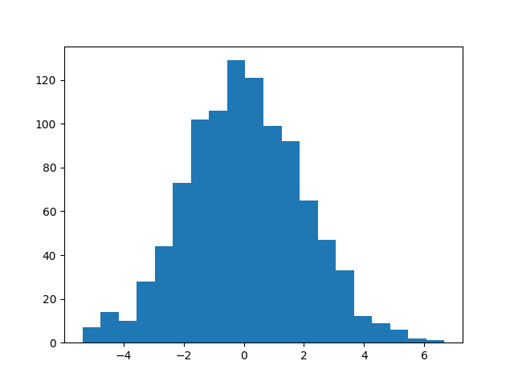
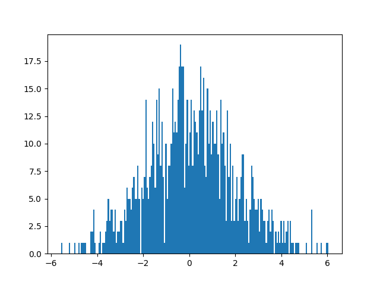

# examples

## line, scatter with defaults

```crystal
figure = Matplotcr::Figure.new
lineplot = Matplotcr::LinePlot.new([1, 2, 3], [5.5, 7.6, 11.1])
lineplot2 = Matplotcr::ScatterPlot.new([1.0, 2.0, 4.5], [1, 2, 3])
figure.add lineplot
figure.add lineplot2
```



## line, scatter with options

```crystal
figure = Matplotcr::Figure.new
x = [1, 2, 3, 4]
y = [5.5, 7.6, 11.1, 6.5]
lineplot = Matplotcr::LinePlot.new(x, y, colour="red", linestyle="--")
lineplot2 = Matplotcr::ScatterPlot.new(x, y, colour="green")
figure.add lineplot
figure.add lineplot2
figure.save("docs/images/test_colour.png")
```



## histograms

With default values:

```crystal
y = Statistics::Normal.sample(1000, 0.0, 2.0)
figure = Matplotcr::Figure.new
hist = Matplotcr::Histogram.new(y)
figure.add hist
figure.save("docs/images/hist_default.png")
```



With custom number of bins:

```crystal
y = Statistics::Normal.sample(1000, 0.0, 2.0)
figure = Matplotcr::Figure.new
hist = Matplotcr::Histogram.new(y, bins=200)
figure.add hist
figure.save("docs/images/hist_bins.png")
```

